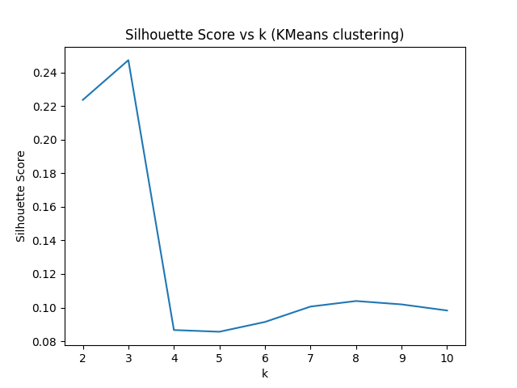
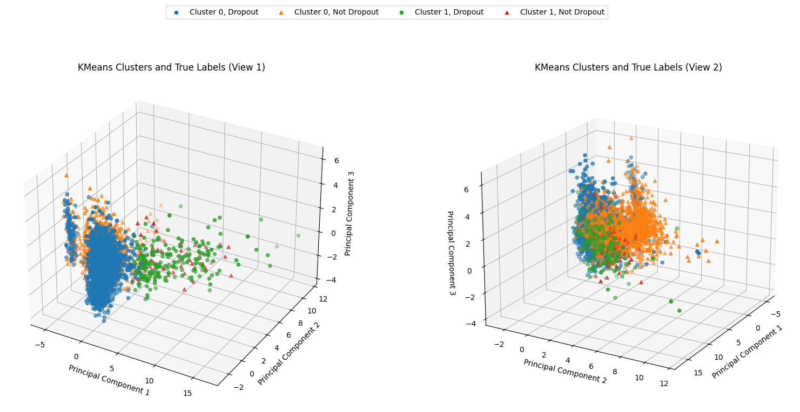
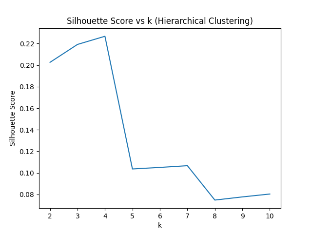
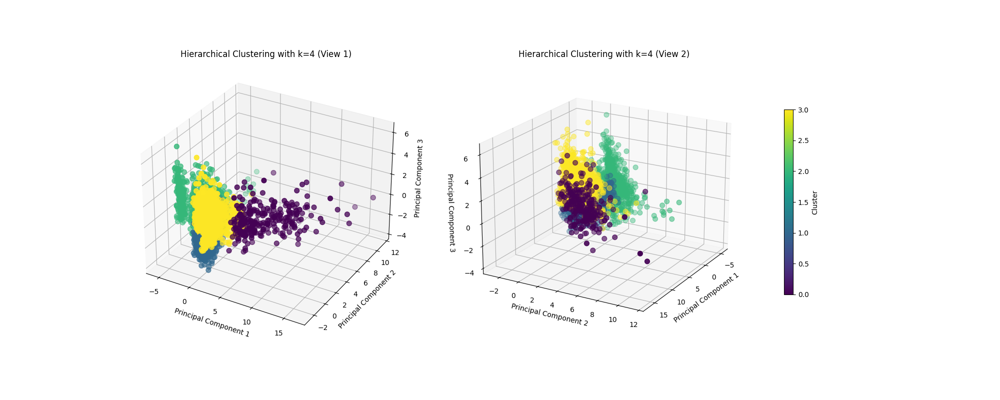

# Student Academic Outcome Prediction

## Overview

This project aims to predict student academic outcomes, focusing on identifying at-risk students who may drop out. Using a dataset from the UCI Machine Learning Repository, we apply data preprocessing, exploratory data analysis (EDA), clustering, outlier detection, feature selection, and classification to understand the factors influencing student success. Our findings can inform targeted intervention strategies for educational institutions to improve retention rates.

## Project Structure

This repository contains the following notebooks:
- **1_preprocess.ipynb**: Data preprocessing.
- **2_eda.ipynb**: Exploratory Data Analysis.
- **3_cluster.ipynb**: Clustering analysis.
- **4_outlier.ipynb**: Outlier detection.
- **5_feature_selection.ipynb**: Feature selection.
- **knn_classify.ipynb, rf_classify.ipynb, svm_classify.ipynb**: Classification using k-NN, Random Forest, and SVM.

Each section in this README details the tasks, results, visualizations, and code references.

---

## 1. Data Preprocessing

Preprocessing ensures data quality for reliable analysis and modeling. Key steps included:
- **Missing Value Handling**: Imputation of numerical values with medians and filling categorical values with placeholders.
- **Encoding**: Categorical features were label-encoded (low cardinality) or one-hot encoded (high cardinality, e.g., Nationality).
- **Normalization**: Numerical academic features were normalized to facilitate clustering and improve model performance.

> Refer to [1_preprocess.ipynb](./1_preprocess.ipynb) for code and results.

## 2. Exploratory Data Analysis (EDA)

EDA provided insight into feature distributions and relationships:
- **Summary Statistics**: Distribution analysis revealed skewness in grades and enrollment status, suggesting early intervention opportunities.
- **Correlation Heatmap**: Academic features, such as grades and credited units, showed strong correlations with student outcomes.
- **Cluster Patterns**: Initial analysis revealed separable groups based on academic performance, hinting at distinct student types.

> See [2_eda.ipynb](./2_eda.ipynb) for visualizations and analysis.

## 3. Clustering

Unsupervised clustering explored potential groupings of students:
- ### KMeans Clustering: 
    #### Methodology and Results
    To determine the optimal number of clusters (`k`), we calculated the **Silhouette Score** for values of `k` ranging from 2 to 10. As shown in the plot below, the highest Silhouette Score was achieved at `k=3`. However, since the **Silhouette Score** for `k=2` and `k=3` are very close  (less than 0.03 difference), **domain knowledge** and the specific problem context should play a significant role in selecting the optimal number of clusters. In this case, since the problem is binary (e.g., “dropout” vs. “not dropout”), using `k=2` might align better with the data’s underlying structure.
    
    For k=4 and beyond, the Silhouette Score dropped significantly to some very low value (~0.09) suggests that the clusters become less meaningful, possibly due to splitting existing clusters or introducing noise. Overall, the relatively low scores (maximum ~0.25) suggest that the dataset does not form highly distinct clusters, which might result from overlapping features or noise.

    **We chose k = 2 as the optimal number of clusters of Kmeans.**

    

    After selecting `k=2`, we applied K-Means clustering to the dataset. To visualize the clusters, we reduced the data to **3** dimensions using **Principal Component Analysis (PCA)**. The resulting clusters are displayed in the 3D scatter plot below. Each color represents a distinct cluster.

    

    The 3D scatter plot of KMeans clusters in the PCA-reduced space shows three distinct groups:
	-	One cluster is densely packed, while the other two are more dispersed.
	-	The separation between clusters is visible, but some overlap exists, particularly between two clusters.
	-	This indicates that while the algorithm can group the data meaningfully, the feature space may not fully separate the underlying groups.

    We also compared the clusters to the actual target labels (dropout, not dropout) by coloring the points based on their true categories. This revealed some overlap between the clusters and target labels, as shown below:

    

    #### Insights
    - The results suggest that K-Means with `k=2` groups students into clusters, likely representing at-risk students, and average performers.
    - The overlap between clusters and target labels suggests the clusters capture general groupings but do not well align with the true outcomes. This indicates potential for further refinement, such as using additional clustering methods or improving feature engineering.

- ### Hierarchical Clustering: 

    #### Methodology and Results

    To determine the optimal number of clusters (`k`), we calculated the **Silhouette Score** for values of `k` ranging from 2 to 10 using Agglomerative Clustering (Hierarchical Clustering). The plot below displays the **Silhouette Scores** for different values of `k`:

    

    - The highest **Silhouette Score** of **0.23** was observed at **k=4**.
    - Scores for **k=2** and **k=3** were also relatively high, which aligns with the binary nature of the dataset (dropout vs. not dropout).
    - Beyond `k=4`, the scores drop significantly, indicating that higher cluster values might introduce noise or split meaningful groupings.

    After selecting **k=4**, Hierarchical Clustering was applied to the dataset. The data was reduced to **3 dimensions** using **Principal Component Analysis (PCA)** for visualization. Two 3D scatter plots were generated to display the clusters from different viewpoints:

    

    #### Insights

    The 3D scatter plots reveal the following:
    1. Four distinct clusters are visible, with varying densities and overlaps.
    2. Overlaps between clusters suggest some complexity in the dataset that hierarchical clustering struggles to fully separate.
    3. Comparing these clusters with true labels (dropout vs. not dropout) reveals that while some alignment exists, significant overlaps remain.

    To analyze the relationship between clusters and the actual target labels, the clusters were visualized with true labels in a separate plot:

    

    #### Observations
    1. **Binary Nature of the Dataset**: While `k=4` maximized the Silhouette Score, using **k=2** might better align with the binary classification of dropout vs. not dropout.
    2. **Granularity**: Higher values of `k` (e.g., `k=4`) provide a more granular view but might introduce noise or split meaningful groupings.
    3. **Alignment with True Labels**: Overlaps between clusters and true labels suggest that hierarchical clustering captures general groupings but does not fully separate the classes.

    #### Conclusion
    - **Best k**: While **k=4** achieves the highest Silhouette Score, **k=2** aligns better with the binary nature of the dataset and simplifies interpretation.
    - **Clustering Quality**: Hierarchical clustering provides moderate separation, but overlaps suggest the need for feature engineering or alternative clustering methods.
    - **Future Directions**: Refining features or experimenting with different distance metrics may improve clustering performance.

- **DBSCAN**: 

> Refer to [3_cluster.ipynb](./3_cluster.ipynb) for detailed clustering steps and visuals.

## 4. Outlier Detection

Outlier detection was applied to highlight atypical students:
- **Isolation Forest, Local Outlier Factor, and Elliptic Envelope**: These methods identified students with unusual academic patterns. Multiple methods helped ensure robustness.
- **Visualization**: PCA-based scatter plots showed the spread and positioning of outliers.

> Check [4_outlier.ipynb](./4_outlier.ipynb) for the outlier detection process and visualizations.

## 5. Feature Selection

Feature selection was applied to improve model efficiency and accuracy:
- **Recursive Feature Elimination (RFE)**: Used to rank features, helping to retain those with the strongest predictive power.
- **Random Forest Feature Importance**: Provided insights into feature relevance, with academic performance metrics emerging as significant predictors.

> See [5_feature_selection.ipynb](./5_feature_selection.ipynb) for feature selection results.

## 6. Classification
Because our goal for this project is to identify and to help struggling students, we want the False Negative counts to be as small as possible. That means we do not want struggling students to be identified as not struggling and eventually drop out due to our classification error and not helping them. Therefore, we use the recall as the primary score but would also consider accuracy. This is because if we only consider recall then it is best to identify every target as True and then help every student which is probably not possible due to limited teaching and aid resources.
During hyperparameter searching for the classifiers, we generally use roc-auc instead of accuracy as the scoring function. This can improve recall while keeping the accuracy in a relatively high range. We used the GridSearchCV function which performed 5-fold cross validation on the training data for the hyperparameter search.
The prediction is generated as a probability which can be determined by a probability threshold value whether the sample belongs to the positive or negative class. This threshold value constitutes another hyperparameter that should be searched before predicting the testing data. During this hyperparameter search, 80% of the training data was used for training the model and the rest of the training data was used as the validation data.

- **Support Vector Machine (SVM)**:
For SVM, the class_weight parameter is chosen to be “balanced” to increase the class weight for the positive class (Dropout) based on its corresponding sample frequency relative to the negative class (Enrolled or Graduate). 
Hyperparameter search was performed based on scoring for “roc-auc” and searched on parameter C, gamma, and kernel. The result roc_auc = 0.9312 when C = 200, gamma = 0.0001, kernel = rbf. 
Hyperparameter search was also performed on the decision probability threshold. A threshold value of 0.12 is chosen to achieve a higher recall score while keeping the accuracy score relatively reasonable.
Ten fold cross validation was performed on the training data with accuracy mean = 0.8705 and accuracy std = 0.0113 showing that the model is consistent with different training samples.
The fitted SVM model was used to predict the test data to achieve recall = 0.8132 and accuracy = 0.8497. When the decision probability threshold is set to be 0.12, it achieved a recall value of 0.9177 and accuracy of 0.7853. That means we can identify and help over 90% of the struggling students while not wasting too much aiding resources on non-struggling students.
The prediction probability values were then used to plot the roc curve using the built-in roc_curve function by setting different thresholds to emulate different models. It achieved a resulting roc-auc of 0.9134.

> Check [svm_classify.ipynb](./notebooks/6_classification/svm_classify.ipynb) for details

- **Random Forest**:
Similar to SVM, a “balanced” class_weight is chosen for the classifier to avoid skewing in sample classes.
Hyperparameter search was performed based on scoring for “roc-auc” and searched on parameter n_estimators, max_depth, and criterion. The result roc_auc = 0.9194 on the training data when max_depth = 50, n_estimators = 300, criterion = entropy. 
Hyperparameter search was also performed on the decision probability threshold. A threshold value of 0.16 is chosen to achieve a higher recall score while keeping the accuracy score relatively reasonable.
Ten fold cross validation was performed on the training data with accuracy mean = 0.8765 and accuracy std = 0.0083 showing that the model is consistent with different training samples.
The fitted Random Forest model was used to predict the test data to achieve recall = 0.8955 and accuracy = 0.7548 with decision probability threshold set to be 0.16.
The prediction probability values were then used to plot the roc curve using the built-in roc_curve function by setting different thresholds to emulate different models. It achieved a resulting roc-auc of 0.9078.

> Check ([rf_classify.ipynb](./rf_classify.ipynb) for implementation and detailed results.

- **k-Nearest Neighbors (k-NN)**:
For k-NN, a hyperparameter search is performed on parameter n_neighbors, weights, and metric with roc-auc as the scoring function. The maximum roc-auc = 0.8952 is reached when n_neighbors = 77, metric = manhattan and weights = distance. 
A hyperparameter search for the probability threshold is then performed on the training data, and threshold = 0.15 was determined to be a balanced choice between recall and accuracy with emphasis on recall score.
We used 5-fold cross validation on the training data with resulting accuracy mean = 0.8174 and accuracy std = 0.0068. This showed that the model is consistent with different training data sets.
The fitted k-NN model was used to predict the test data to achieve recall = 0.8449 and accuracy = 0.7649 with decision probability threshold set to be 0.15.
The prediction probability values were then used to plot the roc curve using the built-in roc_curve function by setting different thresholds to emulate different models. It achieved a resulting roc-auc of 0.8763.

> Check ([knn_classify.ipynb](./knn_classify.ipynb) for implementation and detailed results.

## 7. Hyperparameter Tuning
See section Classification for related hyperparameter tuning details.
---

## Conclusion and Future Work

### Key Findings

### Challenges and Limitations

### Future Enhancements

---

This README serves as a comprehensive report for the project, with links to the code in each notebook for further exploration.

