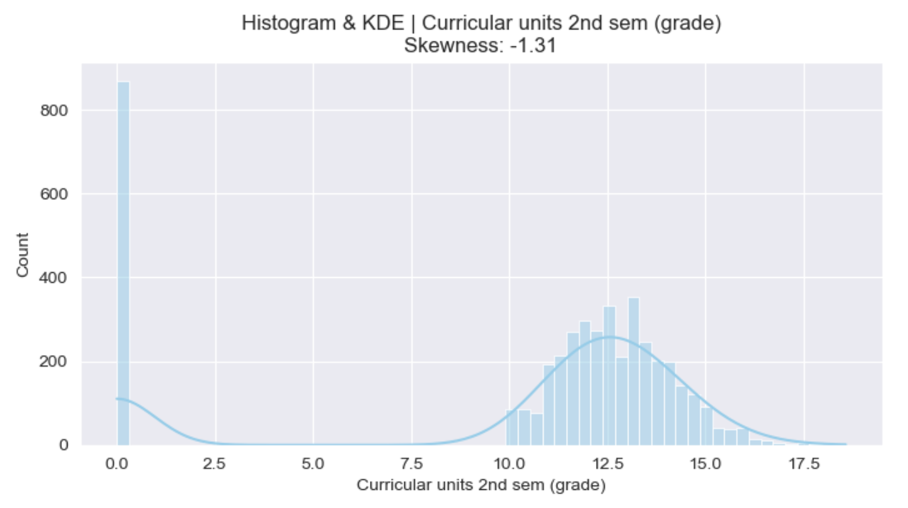
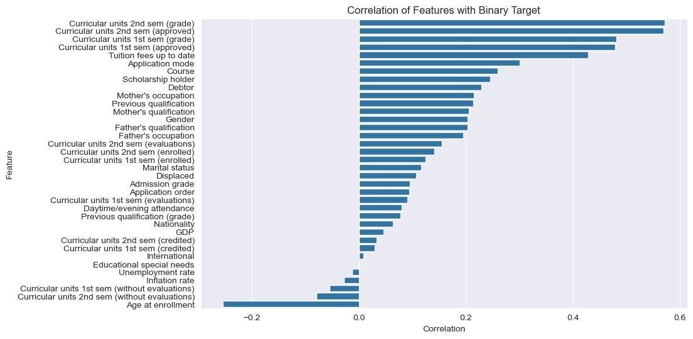
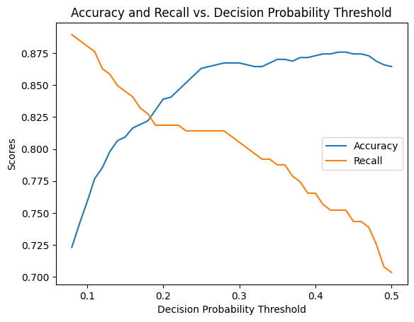
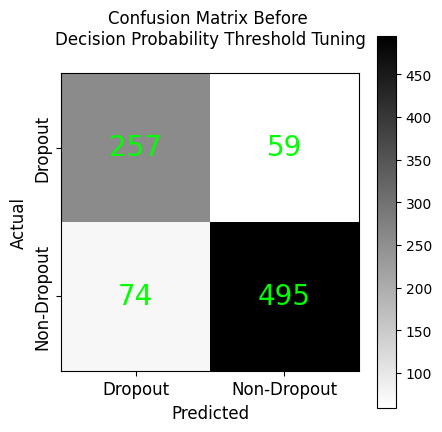

# Student Academic Outcome Prediction

## Overview

This project aims to predict student academic outcomes, focusing on identifying at-risk students who may drop out. Using a dataset from the UCI Machine Learning Repository, we apply data preprocessing, exploratory data analysis (EDA), clustering, outlier detection, feature selection, and classification to understand the factors influencing student success. Our findings can inform targeted intervention strategies for educational institutions to improve retention rates.

## Project Structure

This repository contains the following notebooks:
- **1_preprocess.ipynb**: Data preprocessing.
- **2_eda.ipynb**: Exploratory Data Analysis.
- **3_cluster.ipynb**: Clustering analysis.
- **4_outlier.ipynb**: Outlier detection.
- **5_feature_selection.ipynb**: Feature selection.
- **knn_classify.ipynb, rf_classify.ipynb, svm_classify.ipynb**: Classification using k-NN, Random Forest, and SVM.

Each section in this README details the tasks, results, visualizations, and code references.

---

## 1. Exploratory Data Analysis (EDA)

The original dataset contains all numeric values, as categorical features have been mapped into numbers. For instance, the marital status was mapped as follows:
| Numeric Value | Category          |
|:-------------:|-------------------|
| 1             | Single            |
| 2             | Married           |
| 3             | Widow             |
| 4             | Divorced          |
| 5             | Facto Union       |
| 6             | Legally Separated |

To make the data easier to interpret in visualizations, we converted these numeric values back to their string labels before plotting.

EDA provided comprehensive insights into the dataset:
- **Data Overview**: To get basic information about the dataset, the table below provides an overview of the dataset including feature names, data type, number of missing values, number of unique values and summary of statistics for numerical features:
<table><thead>
  <tr>
    <th rowspan="2">Feature Name</th>
    <th rowspan="2">Data Type</th>
    <th rowspan="2">Number of Missing values</th>
    <th rowspan="2">Number of Unique Values</th>
    <th colspan="3">Summary Statistics</th>
  </tr>
  <tr>
    <th>Min</th>
    <th>Mean</th>
    <th>Max</th>
  </tr></thead>
<tbody>
  <tr>
    <td>Marital status</td>
    <td>object</td>
    <td>0</td>
    <td>6</td>
    <td></td>
    <td></td>
    <td></td>
  </tr>
  <tr>
    <td>Application mode</td>
    <td>object</td>
    <td>0</td>
    <td>18</td>
    <td></td>
    <td></td>
    <td></td>
  </tr>
  <tr>
    <td>Application order</td>
    <td>int64</td>
    <td>0</td>
    <td>8</td>
    <td>0</td>
    <td>1.7278</td>
    <td>9</td>
  </tr>
  <tr>
    <td>Course</td>
    <td>object</td>
    <td>0</td>
    <td>17</td>
    <td></td>
    <td></td>
    <td></td>
  </tr>
  <tr>
    <td>Daytime/evening attendance</td>
    <td>object</td>
    <td>0</td>
    <td>2</td>
    <td></td>
    <td></td>
    <td></td>
  </tr>
  <tr>
    <td>Previous qualification</td>
    <td>object</td>
    <td>0</td>
    <td>17</td>
    <td></td>
    <td></td>
    <td></td>
  </tr>
  <tr>
    <td>Previous qualification (grade)</td>
    <td>float64</td>
    <td>0</td>
    <td>101</td>
    <td>95</td>
    <td>132.61</td>
    <td>190</td>
  </tr>
  <tr>
    <td>Nationality</td>
    <td>object</td>
    <td>0</td>
    <td>21</td>
    <td></td>
    <td></td>
    <td></td>
  </tr>
  <tr>
    <td>Mother's qualification</td>
    <td>object</td>
    <td>0</td>
    <td>29</td>
    <td></td>
    <td></td>
    <td></td>
  </tr>
  <tr>
    <td>Father's qualification</td>
    <td>object</td>
    <td>0</td>
    <td>34</td>
    <td></td>
    <td></td>
    <td></td>
  </tr>
  <tr>
    <td>Mother's occupation</td>
    <td>object</td>
    <td>0</td>
    <td>32</td>
    <td></td>
    <td></td>
    <td></td>
  </tr>
  <tr>
    <td>Father's occupation</td>
    <td>object</td>
    <td>0</td>
    <td>46</td>
    <td></td>
    <td></td>
    <td></td>
  </tr>
  <tr>
    <td>Admission grade</td>
    <td>float64</td>
    <td>0</td>
    <td>620</td>
    <td>95</td>
    <td>126.98</td>
    <td>190</td>
  </tr>
  <tr>
    <td>Displaced</td>
    <td>object</td>
    <td>0</td>
    <td>2</td>
    <td></td>
    <td></td>
    <td></td>
  </tr>
  <tr>
    <td>Educational special needs</td>
    <td>object</td>
    <td>0</td>
    <td>2</td>
    <td></td>
    <td></td>
    <td></td>
  </tr>
  <tr>
    <td>Debtor</td>
    <td>object</td>
    <td>0</td>
    <td>2</td>
    <td></td>
    <td></td>
    <td></td>
  </tr>
  <tr>
    <td>Tuition fees up to date</td>
    <td>object</td>
    <td>0</td>
    <td>2</td>
    <td></td>
    <td></td>
    <td></td>
  </tr>
  <tr>
    <td>Gender</td>
    <td>object</td>
    <td>0</td>
    <td>2</td>
    <td></td>
    <td></td>
    <td></td>
  </tr>
  <tr>
    <td>Scholarship holder</td>
    <td>object</td>
    <td>0</td>
    <td>2</td>
    <td></td>
    <td></td>
    <td></td>
  </tr>
  <tr>
    <td>Age at enrollment</td>
    <td>int64</td>
    <td>0</td>
    <td>46</td>
    <td>17</td>
    <td>23.265</td>
    <td>70</td>
  </tr>
  <tr>
    <td>International</td>
    <td>object</td>
    <td>0</td>
    <td>2</td>
    <td></td>
    <td></td>
    <td></td>
  </tr>
  <tr>
    <td>Curricular units 1st sem (credited)</td>
    <td>int64</td>
    <td>0</td>
    <td>21</td>
    <td>0</td>
    <td>0.7100</td>
    <td>20</td>
  </tr>
  <tr>
    <td>Curricular units 1st sem (enrolled)</td>
    <td>int64</td>
    <td>0</td>
    <td>23</td>
    <td>0</td>
    <td>6.2706</td>
    <td>26</td>
  </tr>
  <tr>
    <td>Curricular units 1st sem (evaluations)</td>
    <td>int64</td>
    <td>0</td>
    <td>35</td>
    <td>0</td>
    <td>8.2991</td>
    <td>45</td>
  </tr>
  <tr>
    <td>Curricular units 1st sem (approved)</td>
    <td>int64</td>
    <td>0</td>
    <td>23</td>
    <td>0</td>
    <td>4.7066</td>
    <td>26</td>
  </tr>
  <tr>
    <td>Curricular units 1st sem (grade)</td>
    <td>float64</td>
    <td>0</td>
    <td>805</td>
    <td>0</td>
    <td>10.641</td>
    <td>18.875</td>
  </tr>
  <tr>
    <td>Curricular units 1st sem (without evaluations)</td>
    <td>int64</td>
    <td>0</td>
    <td>11</td>
    <td>0</td>
    <td>0.1377</td>
    <td>12</td>
  </tr>
  <tr>
    <td>Curricular units 2nd sem (credited)</td>
    <td>int64</td>
    <td>0</td>
    <td>19</td>
    <td>0</td>
    <td>0.5418</td>
    <td>19</td>
  </tr>
  <tr>
    <td>Curricular units 2nd sem (enrolled)</td>
    <td>int64</td>
    <td>0</td>
    <td>22</td>
    <td>0</td>
    <td>6.2321</td>
    <td>23</td>
  </tr>
  <tr>
    <td>Curricular units 2nd sem (evaluations)</td>
    <td>int64</td>
    <td>0</td>
    <td>30</td>
    <td>0</td>
    <td>8.0633</td>
    <td>33</td>
  </tr>
  <tr>
    <td>Curricular units 2nd sem (approved)</td>
    <td>int64</td>
    <td>0</td>
    <td>20</td>
    <td>0</td>
    <td>4.4358</td>
    <td>20</td>
  </tr>
  <tr>
    <td>Curricular units 2nd sem (grade)</td>
    <td>float64</td>
    <td>0</td>
    <td>786</td>
    <td>0</td>
    <td>10.230</td>
    <td>18.571</td>
  </tr>
  <tr>
    <td>Curricular units 2nd sem (without evaluations)</td>
    <td>int64</td>
    <td>0</td>
    <td>10</td>
    <td>0</td>
    <td>0.1503</td>
    <td>12</td>
  </tr>
  <tr>
    <td>Unemployment rate</td>
    <td>float64</td>
    <td>0</td>
    <td>10</td>
    <td>7.6</td>
    <td>11.566</td>
    <td>16.2</td>
  </tr>
  <tr>
    <td>Inflation rate</td>
    <td>float64</td>
    <td>0</td>
    <td>9</td>
    <td>-0.8</td>
    <td>1.2280</td>
    <td>3.7</td>
  </tr>
  <tr>
    <td>GDP</td>
    <td>float64</td>
    <td>0</td>
    <td>10</td>
    <td>-4.06</td>
    <td>0.0020</td>
    <td>3.51</td>
  </tr>
  <tr>
    <td>Target</td>
    <td>object</td>
    <td>0</td>
    <td>3</td>
    <td></td>
    <td></td>
    <td></td>
  </tr>
</tbody></table>

- **Distribution Analysis**: Using distribution analysis, we could understand how to handle the dataset during preprocess. For example, we can identify features with skewed distribution and notice these features need data transformation. To focus the analysis, target variable and a feature with the highest correlation to the target variable are selected for visulaization.

  

  The target variable consists of three categories: Dropout, Graduate, and Enrolled. Since our focus is on predicting student dropout, it can be converted to a binary form.

  

  The distribution of this feature is negative skewed and this can be handeled by normalization.

- **Correlation of Features with Target**: To understand the relationship between the features and the target variable, we computed the correlation of each feature with the target. For numerical features, we used the point-biserial correlation coefficient and for categorical features, we used Cramer's V.

    

    Academic features, such as grades and approved units, showed strong correlations with student outcomes.

- **Correlation among Features**: To understand the relationships between the features, we calculated the pairwise correlation. For numerical-numerical features pair, we used Pearson's correlation, for categorical-categorical features pair, we used Cramer's V and for numerical-categorical features pair, we converted categorical feature into binary form and used point-biserial.

    

    'Course' and 'Daytime/evening attendance' pair and 'Nationality' and 'International' pair show very high positive correlation. Also it shows that academic features are strongly associated.

> See [2_eda.ipynb](./2_eda.ipynb) for visualizations and analysis.

## 2. Data Preprocessing

Preprocessing ensures data quality for reliable analysis and modeling. Key steps included:
- **Missing Value Handling**: During EDA, it was observed that all missing values had already been handled in the original data by replacing them with placeholders such as "Unknown" or "(blank)".
- **Encoding**: Categorical features were label-encoded (low cardinality) or one-hot encoded (high cardinality, e.g., Nationality).
- **Normalization**: Numerical academic features were normalized to facilitate clustering and improve model performance.

> Refer to [1_preprocess.ipynb](./1_preprocess.ipynb) for code and results.

## 3. Clustering

Unsupervised clustering explored potential groupings of students:
- **KMeans Clustering**: 
    ### Methodology and Results
    To determine the optimal number of clusters (`k`), we calculated the **Silhouette Score** for values of `k` ranging from 2 to 10. As shown in the plot below, the highest Silhouette Score was achieved at `k=3`. This value was selected as the optimal number of clusters.
    
    For k=4 and beyond, the Silhouette Score dropped significantly to some very low value (~0.09) suggests that the clusters become less meaningful, possibly due to splitting existing clusters or introducing noise. The Silhouette Score supports the choice of k=3 as the optimal number of clusters. However, the relatively low overall scores (maximum ~0.25) suggest that the dataset does not form highly distinct clusters, which might result from overlapping features or noise.

    

    After selecting `k=3`, we applied K-Means clustering to the dataset. To visualize the clusters, we reduced the data to **3** dimensions using **Principal Component Analysis (PCA)**. The resulting clusters are displayed in the 3D scatter plot below. Each color represents a distinct cluster.

    

    The 3D scatter plot of KMeans clusters in the PCA-reduced space shows three distinct groups:
    -	One cluster is densely packed, while the other two are more dispersed.
    -	The separation between clusters is visible, but some overlap exists, particularly between two clusters.
    -	This indicates that while the algorithm can group the data meaningfully, the feature space may not fully separate the underlying groups.

    We also compared the clusters to the actual target labels (dropout, not dropout) by coloring the points based on their true categories. This revealed some overlap between the clusters and target labels, as shown below:

    

    ### Insights
    1. **Optimal Clustering**:
    - The results suggest that K-Means with `k=3` effectively groups students into meaningful clusters, likely representing at-risk students, average performers, and high achievers.

    2. **Cluster Interpretation**:
    - The overlap between clusters and target labels suggests the clusters capture general groupings but do not well align with the true outcomes. This indicates potential for further refinement, such as using additional clustering methods or improving feature engineering.

- **Agglomerative Clustering**: Validated KMeans findings, supporting early indications of distinct student subgroups.
- **PCA Visualization**: 2D and 3D visualizations using PCA showed partial separation, suggesting clustering alone may not capture dropout risk fully.

> Refer to [3_cluster.ipynb](./3_cluster.ipynb) for detailed clustering steps and visuals.

## 4. Outlier Detection

We applied three Outlier detection methods to the scaled and one-hot encoded data (excluding target). The methods used were Isolation Forest, Local Outlier Factor, and Elliptic Envelope. We specified the contamination parameter to be 0.005 for all three methods to be consistent. The features were then reduced to two dimensions using PCA for 2-d visualization. The scatter plot of the PCA-reduced data with outliers shown in red color is shown below:

The results show that Elliptic Envelope method identified outliers are better seperated from the non-outliers it identiried compared to the other two methods. The Local Outlier Factor method and Isolation Forest method identified outliers seems more mixed together with their respective non-outliers. Thus the Elliptic Envelope method seems to be the most promising method for outlier detection in this dataset.

We then inspected all the outliers identified by the Elliptic Envelope method and found no evidence that these outliers are incorrect data. These outliers may be distant from the majority of the data points but they are not necessarily noise or irrelevant data points, and these data points may still contain important information for the later tasks such as classification or clustering. Thus we decided to keep these outliers in the dataset for further analysis.

> Check [4_outlier.ipynb](./notebooks/4_outlier.ipynb) for the outlier detection process and visualizations.

## 5. Feature Selection

Feature selection was applied to improve model efficiency and accuracy:
- **Recursive Feature Elimination (RFE)**: Used to rank features, helping to retain those with the strongest predictive power.
- **Random Forest Feature Importance**: Provided insights into feature relevance, with academic performance metrics emerging as significant predictors.

> See [5_feature_selection.ipynb](./5_feature_selection.ipynb) for feature selection results.

## 6. Classification

### Overview of Classification Methods
Because our goal for this project is to identify and to help struggling students, we want the False Negative counts to be as small as possible. That means we do not want struggling students to be identified as not struggling and eventually drop out due to our classification error and not helping them. Therefore, we use the recall as the primary score but would also consider accuracy. This is because if we only consider recall then it is best to identify every target as True and then help every student which is probably not possible due to limited teaching and aid resources.

During hyperparameter searching for the classifiers, we generally use roc-auc instead of accuracy as the scoring function. This can improve recall while keeping the accuracy in a relatively high range. We used the GridSearchCV function which performed 5-fold cross validation on the training data for the hyperparameter search.

The prediction is generated as a probability which can be determined by a probability threshold value whether the sample belongs to the positive or negative class. This threshold value constitutes another hyperparameter that should be searched before predicting the testing data. During this hyperparameter search, 80% of the training data was used for training the model and the rest of the training data was used as the validation data.

The performance of the classifiers was evaluated using the recall, accuracy, precision, and F1-score. The confusion matrix was also generated to show the number of True Positive, False Positive, True Negative, and False Negative samples. The ROC curve was also generated to show the trade-off between the True Positive Rate and False Positive Rate. The scores of the classifiers were compared to determine the best classifier for this task as follows:

| Metric      | Kernel SVM | Random Forest | K-NN   |
|-------------|------------|---------------|--------|
| Recall      | 0.9177     | 0.8955        | 0.8449 |
| Accuracy    | 0.7853     | 0.7548        | 0.7649 |
| Precision   | 0.6387     | 0.6059        | 0.6267 |
| F1-Score    | 0.7532     | 0.7228        | 0.7196 |
| ROC-AUC     | 0.9134     | 0.9078        | 0.8763 |

### Support Vector Machine (SVM):
For SVM, the class_weight parameter is chosen to be “balanced” to increase the class weight for the positive class (Dropout) based on its corresponding sample frequency relative to the negative class (Enrolled or Graduate). 

Hyperparameter search was performed based on scoring for “roc-auc” and searched on parameter C, gamma, and kernel. The result roc_auc = 0.9312 when C = 200, gamma = 0.0001, kernel = rbf. 

Hyperparameter search was also performed on the decision probability threshold. A threshold value of 0.12 is chosen to achieve a higher recall score while keeping the accuracy score relatively reasonable.

Ten fold cross validation was performed on the training data with accuracy mean = 0.8705 and accuracy std = 0.0113 showing that the model is consistent with different training samples.

The fitted SVM model was used to predict the test data to achieve recall = 0.8132 and accuracy = 0.8497. When the decision probability threshold is set to be 0.12, it achieved a recall value of 0.9177 and accuracy of 0.7853. Also the precision is 0.6387 and the f1-score is 0.7532 That means we can identify and help over 90% of the struggling students while not wasting too much aiding resources on non-struggling students. The confusion matrix after setting the decision probability threshold to 0.12 is as follows:

The prediction probability values were then used to plot the roc curve using the built-in roc_curve function by setting different thresholds to emulate different models. It achieved a resulting roc-auc of 0.9134.

> Check [svm_classify.ipynb](./notebooks/6_classification/svm_classify.ipynb) for details

### Random Forest:
Similar to SVM, a “balanced” class_weight is chosen for the classifier to avoid skewing in sample classes.

Hyperparameter search was performed based on scoring for “roc-auc” and searched on parameter n_estimators, max_depth, and criterion. The result roc_auc = 0.9194 on the training data when max_depth = 50, n_estimators = 300, criterion = entropy. 

Hyperparameter search was also performed on the decision probability threshold. A threshold value of 0.16 is chosen to achieve a higher recall score while keeping the accuracy score relatively reasonable.

Ten fold cross validation was performed on the training data with accuracy mean = 0.8765 and accuracy std = 0.0083 showing that the model is consistent with different training samples.

The fitted Random Forest model was used to predict the test data to achieve recall = 0.8955 and accuracy = 0.7548 with decision probability threshold set to be 0.16. Also the precision is 0.6059 and F1-score is 0.7228. The confusion matrix is as follows:

The prediction probability values were then used to plot the roc curve using the built-in roc_curve function by setting different thresholds to emulate different models. It achieved a resulting roc-auc of 0.9078.

> Check ([rf_classify.ipynb](./notebooks/6_classification/rf_classify.ipynb) for implementation and detailed results.

### k-Nearest Neighbors (k-NN):
For k-NN, a hyperparameter search is performed on parameter n_neighbors, weights, and metric with roc-auc as the scoring function. The maximum roc-auc = 0.8952 is reached when n_neighbors = 77, metric = manhattan and weights = distance. 
A hyperparameter search for the probability threshold is then performed on the training data, and threshold = 0.15 was determined to be a balanced choice between recall and accuracy with emphasis on recall score.
We used 5-fold cross validation on the training data with resulting accuracy mean = 0.8174 and accuracy std = 0.0068. This showed that the model is consistent with different training data sets.
The fitted k-NN model was used to predict the test data to achieve recall = 0.8449 and accuracy = 0.7649 with decision probability threshold set to be 0.15. Also the precision is 0.6267 and the f1-score is 0.7196. The confusion matrix is as follows:

The prediction probability values were then used to plot the roc curve using the built-in roc_curve function by setting different thresholds to emulate different models. It achieved a resulting roc-auc of 0.8763.

> Check ([knn_classify.ipynb](./notebooks/6_classification/knn_classify.ipynb) for implementation and detailed results.

## 7. Hyperparameter Tuning
Use SVM as an example to illustrate the hyperparameter searching process. Before hyperparameter, we used the default settings for SVM to fit the training data and the predict the test data. This result in Accuracy: 0.8655, Recall: 0.7974, Precision: 0.8208, F1 score: 0.8089.

After hyperparameter training on C, gamma, kernel and use roc-auc as the scoring function, we get Recall: 0.8132, Accuracy: 0.8497, Precision: 0.7764
F1 Score: 0.7944. It can be seen that the accuracy goes down a bit but recall goes up, which provides a more balanced result for the different scoring functions.
We also did a hyperparameter search for the threshold of decision probability and determined the accuracy and recall vs. different values of thresholds as follows:

It can be seen that when the threshold decreases, the recall goes up but the accuracy goes down. Based on experience, we can choose a value that corresponds to a high recall and a relatively high accuracy.

Using the default threshold for the classification yields the following confusion matrix:

After applying threshold = 0.12 to the decision probability, we got the following confusion matrix:

It can be seen that the actually true value that is predicted to be false (False Negative) decrease from 59 to 26. That means we reduced the number of students that will drop out and could not be predicted as such by around 56%. This is the most damaging type of mistake we can make and we drastically decreased that kind of mistake. 

The actually not drop out student and predicted to be drop out (False Positive) increase from 74 to 164. However the total number of student that is predicted to be Positive increase only from 331 to 454, which is a 37% increase. This is probably still a manageable increase for the teaching and aiding system. But we can always adjust the threshold based on the available resources that the education system really have.

---

## Conclusion and Future Work

For classification, we used three classification models: Kernel SVM, Random Forest and k-NN. We used roc-auc as the scoring function for hyperparameter search and used recall as the primary measuring score for the final model. We also did a hyperparameter search for the threshold of decision probability to balance the recall and accuracy. Kernel SVM classifier did the best job in terms of overall performance. We can identify and thus help over 90% of the struggling students while not wasting too much aiding resources on non-struggling students (accuracy is 78.5%) using SVM. Random Forest classifier ranked the second and could identify over 89% of the struggling students. k-NN classifier ranked the third and could identify over 84% of the struggling students. 

It is important to determine what scoring function to use in a data mining task and what kind of mistakes are the most costly and should be avoided. In this case, we want to avoid the False Negative mistakes as much as possible and thus we use recall as the primary score. To keep the accuracy in a reasonable range, we use roc-auc as the scoring function for hyperparameter search.

### Key Findings

### Challenges and Limitations

The dataset we used is relatively small and came from a country (Portugal) with a specific education system. The results we got may not be generalizable to other countries or regions. We did not do any data augmentation or use any external data to improve the model performance. The dataset is also imbalanced with the majority of the students not dropping out so that may affect the model performance. We did not create any new features or use any advanced feature engineering techniques to improve the model performance. 

### Future Enhancements

We can incorporate more data from different countries and regions to improve the model performance. We can also use data augmentation techniques to improve the model performance. We may try more advanced data classification techniques such as deep learning to improve the model performance and/or use more advanced feature engineering techniques to improve the model performance. 

---

This README serves as a comprehensive report for the project, with links to the code in each notebook for further exploration.

